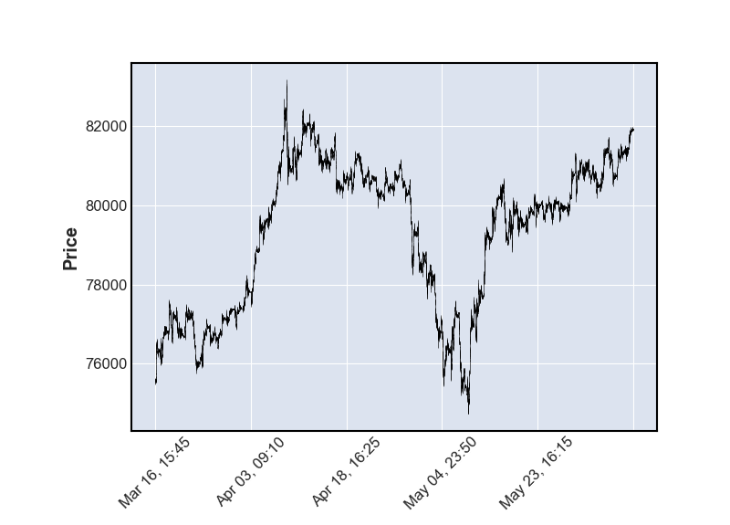

# Испытание модели нейронной сети с LSTM слоем
Цель настоящей работы проверить возможность с помощью рекурентной нейронной сети (RNN) на основе предоставленной временной последовательности с данными о цене того или иного биржевого актива выдать более менее точное предсказание (75% или более) цены, которой данный актив достигнет в следующий временной интервал. 
### **1. Добавление локальных экстремумов:**

При добавлении локальных экстремумов к базе данных, подготовленной для обучения НС, необходимо руководствоваться соображением, что для последней свечи в передаваемой последовательности, не может быть установлена категория локального минимума или максимума. Для этого нужны сведения о цене закрытия следующей свечи, которой на момент анализа у нас нет. Таким образом последняя свеча в последовательности будет всегда иметь категорию 0 (то есть отсутствие экстремума).

Для испытания будут взяты модели со следующими параметрами:

Data options:\
LENGTH = 10000\
ROUND = 5\
NORM = 'std'

Dataset options:\
LABEL_SIZE = 1\
SHIFT = 1\
WARM_UP = 100\
LABEL_NAMES = ['Close']

RNN options:\
NEURONS = 8\
L_RATE = 0.00003\
LOSS = 'mean_absolute_error'\
METR = 'mean_absolute_error'

***
### **model(#0001)**
FEATURES: ['Open','High', 'Low', 'Close', 'Loc_Min', Loc_Max]\
INP_SIZE = 6 

#0001_prediction analyzing:\
Mean loss (pt): 43\
Matching PC ratio: 51%\
Matching PP ratio: 51%\
Data filtered by column ['Pred_Close_diff']\
Condition: value < -43 | value > 43\
Data compression: 76%\
Filtered matching PC ratio: 53%\
Filtered matching PP ratio: 49%

***
### **model(#0002)**
FEATURES: ['Open','High', 'Low', 'Close', 'Loc_Min', Loc_Max]\
INP_SIZE = 12\

#0002_prediction analyzing:\
Mean loss (pt): 44\
Matching PC ratio: 50%\
Matching PP ratio: 51%\
Data filtered by column ['Pred_Close_diff']\
Condition: value < -44 | value > 44\
Data compression: 75%\
Filtered matching PC ratio: 55%\
Filtered matching PP ratio: 51%

***
### **model(#0003)**
FEATURES: ['Open','High', 'Low', 'Close', 'Loc_Min', Loc_Max]\
INP_SIZE = 18\

#0003_prediction analyzing:\
Mean loss (pt): 45\
Matching PC ratio: 51%\
Matching PP ratio: 51%\
Data filtered by column ['Pred_Close_diff']\
Condition: value < -45 | value > 45\
Data compression: 75%\
Filtered matching PC ratio: 55%\
Filtered matching PP ratio: 50%

***
### **model(#0004)**
FEATURES: ['Open','High', 'Low', 'Close', 'Loc_Min', Loc_Max]\
INP_SIZE = 24\

#0004_prediction analyzing:\
Mean loss (pt): 45\
Matching PC ratio: 51%\
Matching PP ratio: 52%\
Data filtered by column ['Pred_Close_diff']\
Condition: value < -45 | value > 45\
Data compression: 74%\
Filtered matching PC ratio: 54%\
Filtered matching PP ratio: 50%

***
### **model(#0005)**
FEATURES: ['Open','High', 'Low', 'Close', 'Corelation6' 'Loc_Min', Loc_Max]\
INP_SIZE = 6\

#0005_prediction analyzing:\
Mean loss (pt): 44\
Matching PC ratio: 51%\
Matching PP ratio: 51%\
Data filtered by column ['Pred_Close_diff']\
Condition: value < -44 | value > 44\
Data compression: 76%\
Filtered matching PC ratio: 51%\
Filtered matching PP ratio: 50%

***
### **model(#0006)**
FEATURES: ['Open','High', 'Low', 'Close', 'Corelation6' 'Loc_Min', Loc_Max]\
INP_SIZE = 15\
SHIFT = 5 - predict 5th candle after sequence

#0006_prediction analyzing:\
Mean loss (pt): 89\
Matching PC ratio: 54%\
Matching PP ratio: 48%\
Data filtered by column ['Pred_Close_diff']\
Condition: value < -89 | value > 89\
Data compression: 77%\
Filtered matching PC ratio: 58%\
Filtered matching PP ratio: 48%